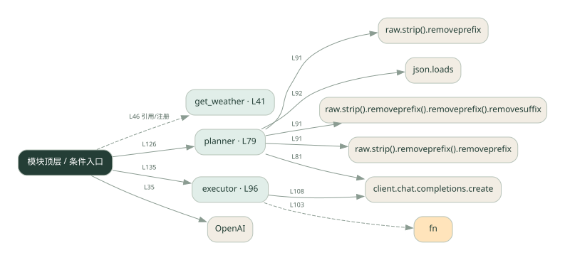
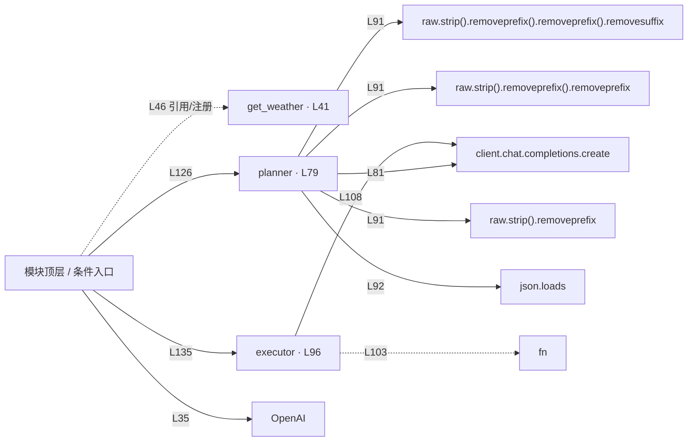

# plan_agent.py · 先计划再执行

课程：1-6 · 全课程第 6 节。源码快照 SHA-256 前 12 位：`b96463f79944`。

[原文件](../plan_agent.py) · [网页阅读](pages/plan_agent.py.html) · [放大调用图](graphs/plan_agent.py.svg)

## 这份文件要完成什么

先生成步骤，再让执行器按步骤调用工具并汇总。

## 为什么需要它

复杂问题一次直接回答容易漏步骤；拆开后能检查每步是否完成。

## 当前文件的实际状态

- 模型请求与本地工具是不同边界：这些文件中的天气工具使用示例逻辑，不能将示例天气当成实时查询结果。
- 存在外部服务或模型依赖；执行前需按源文件配置依赖和凭据，可能联网或产生 API 费用。 本次只做静态解析，没有运行练习，也没有替你填写或修改原代码。

## 调用图 / 阅读与数据流程

实线：源码中的直接调用；虚线：函数引用/注册、动态调用或按方法名推断的候选。L 是调用所在源码行号。箭头不表示执行顺序或每次必经；分支、循环、异步调度及框架内部调用需结合源码。灰色是外部/未解析目标，橙色是动态分发；省略 print、len 和常规容器操作以减少干扰。孤立函数可能尚未接入。

Mermaid 图源

## 从哪里开始看

先从 模块入口 出发，沿箭头找到本文件函数，再查看外部调用或动态分发。右侧调用清单保留所有静态调用点，能回到原文件逐行对照。

## 关键函数与依赖

| 函数 / 定义行 | 职责（源码注释供参考） | 函数体中的调用 |
|---|---|---|
| `get_weather` [L41](../plan_agent.py#L41) | 查询天气（模拟） | `未发现显式函数调用（可能直接计算、读写状态或尚未实现）` |
| `planner` [L79](../plan_agent.py#L79) | 阶段 1：让 LLM 一次性输出完整计划 | `client.chat.completions.create, raw.strip().removeprefix().removeprefix().removesuffix().strip, raw.strip().removeprefix().removeprefix().removesuffix, raw.strip().removeprefix().removeprefix, raw.strip().removeprefix, raw.strip, json.loads` |
| `executor` [L96](../plan_agent.py#L96) | 阶段 2：按顺序执行每个步骤 | `s.get, fn, results.append, 动态对象.join, client.chat.completions.create` |

## 这样做的优点

计划可见，失败时容易定位到具体步骤。

## 代价与局限

计划可能一开始就错；计划器和执行器增加调用成本。

## 适合什么场景

依赖顺序明确的查询、比较和计算任务。

## 不适合直接照搬的场景

一句话就能回答的问题，或环境变化太快却没有重新规划能力的任务。

## 改一个条件，检验是否理解

删掉计划中的一个必要步骤，观察执行器能否发现结果缺失。

如果当前文件有未实现位置，先预测应该怎样变化，补齐后再验证；不要把“能启动”当作“实现正确”。

## 全部静态调用点

这是语法分析清单，包含图中省略的基础操作；不记录参数值。

| 调用方 | 目标表达式 | 行号 | 类型 |
|---|---|---|---|
| <模块入口> | `OpenAI` | 35 | 调用表达式 |
| planner | `client.chat.completions.create` | 81 | 调用表达式 |
| planner | `raw.strip().removeprefix().removeprefix().removesuffix().strip` | 91 | 调用表达式 |
| planner | `raw.strip().removeprefix().removeprefix().removesuffix` | 91 | 调用表达式 |
| planner | `raw.strip().removeprefix().removeprefix` | 91 | 调用表达式 |
| planner | `raw.strip().removeprefix` | 91 | 调用表达式 |
| planner | `raw.strip` | 91 | 调用表达式 |
| planner | `json.loads` | 92 | 调用表达式 |
| executor | `s.get` | 100 | 调用表达式 |
| executor | `fn` | 103 | 调用表达式 |
| executor | `results.append` | 104 | 调用表达式 |
| executor | `动态对象.join` | 107 | 调用表达式 |
| executor | `client.chat.completions.create` | 108 | 调用表达式 |
| executor | `results.append` | 116 | 调用表达式 |
| <模块入口> | `print` | 123 | 调用表达式 |
| <模块入口> | `print` | 124 | 调用表达式 |
| <模块入口> | `print` | 125 | 调用表达式 |
| <模块入口> | `planner` | 126 | 调用表达式 |
| <模块入口> | `print` | 127 | 调用表达式 |
| <模块入口> | `s.get` | 129 | 调用表达式 |
| <模块入口> | `print` | 130 | 调用表达式 |
| <模块入口> | `print` | 132 | 调用表达式 |
| <模块入口> | `print` | 133 | 调用表达式 |
| <模块入口> | `print` | 134 | 调用表达式 |
| <模块入口> | `executor` | 135 | 调用表达式 |
| <模块入口> | `print` | 137 | 调用表达式 |
| <模块入口> | `print` | 139 | 调用表达式 |
| <模块入口> | `print` | 140 | 调用表达式 |
| <模块入口> | `print` | 141 | 调用表达式 |
| <模块入口> | `print` | 143 | 调用表达式 |
| <模块入口> | `get_weather` | 46 | 函数引用/注册 |
