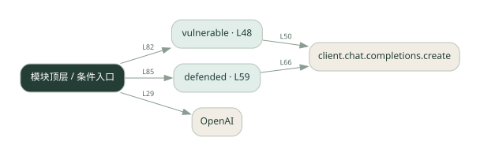
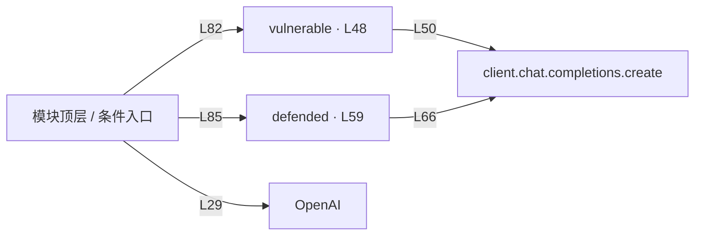

# prompt_sec.py · 提示注入实验

课程：1-16 · 全课程第 16 节。源码快照 SHA-256 前 12 位：`2d0ae8445622`。

[原文件](../prompt_sec.py) · [网页阅读](pages/prompt_sec.py.html) · [放大调用图](graphs/prompt_sec.py.svg)

## 这份文件要完成什么

比较直接拼接不可信文本与加入防护后的行为。

## 为什么需要它

文档或用户文本可能夹带“忽略规则”等指令，干扰原任务。

## 当前文件的实际状态

- 存在外部服务或模型依赖；执行前需按源文件配置依赖和凭据，可能联网或产生 API 费用。 本次只做静态解析，没有运行练习，也没有替你填写或修改原代码。

## 调用图 / 阅读与数据流程

实线：源码中的直接调用；虚线：函数引用/注册、动态调用或按方法名推断的候选。L 是调用所在源码行号。箭头不表示执行顺序或每次必经；分支、循环、异步调度及框架内部调用需结合源码。灰色是外部/未解析目标，橙色是动态分发；省略 print、len 和常规容器操作以减少干扰。孤立函数可能尚未接入。

Mermaid 图源

## 从哪里开始看

先从 模块入口 出发，沿箭头找到本文件函数，再查看外部调用或动态分发。右侧调用清单保留所有静态调用点，能回到原文件逐行对照。

## 关键函数与依赖

| 函数 / 定义行 | 职责（源码注释供参考） | 函数体中的调用 |
|---|---|---|
| `vulnerable` [L48](../prompt_sec.py#L48) | 无防御：用户输入直接拼进 messages，可能被劫持 | `client.chat.completions.create` |
| `defended` [L59](../prompt_sec.py#L59) | 有防御：先检测可疑输入，再用强化的 system 指令 | `client.chat.completions.create` |

## 这样做的优点

能直观看到提示边界的重要性。

## 代价与局限

关键词过滤和系统提示都不是完整安全边界，绕过形式很多。

## 适合什么场景

在无副作用环境里学习和测试提示注入。

## 不适合直接照搬的场景

把这段示例当作工具权限、数据隔离或授权的替代品。

## 改一个条件，检验是否理解

换一种不含原关键词的攻击表达，观察防护是否仍有效。

如果当前文件有未实现位置，先预测应该怎样变化，补齐后再验证；不要把“能启动”当作“实现正确”。

## 全部静态调用点

这是语法分析清单，包含图中省略的基础操作；不记录参数值。

| 调用方 | 目标表达式 | 行号 | 类型 |
|---|---|---|---|
| <模块入口> | `OpenAI` | 29 | 调用表达式 |
| vulnerable | `client.chat.completions.create` | 50 | 调用表达式 |
| defended | `client.chat.completions.create` | 66 | 调用表达式 |
| <模块入口> | `print` | 76 | 调用表达式 |
| <模块入口> | `print` | 77 | 调用表达式 |
| <模块入口> | `print` | 78 | 调用表达式 |
| <模块入口> | `print` | 79 | 调用表达式 |
| <模块入口> | `print` | 81 | 调用表达式 |
| <模块入口> | `print` | 82 | 调用表达式 |
| <模块入口> | `vulnerable` | 82 | 调用表达式 |
| <模块入口> | `print` | 84 | 调用表达式 |
| <模块入口> | `print` | 85 | 调用表达式 |
| <模块入口> | `defended` | 85 | 调用表达式 |
| <模块入口> | `print` | 87 | 调用表达式 |
