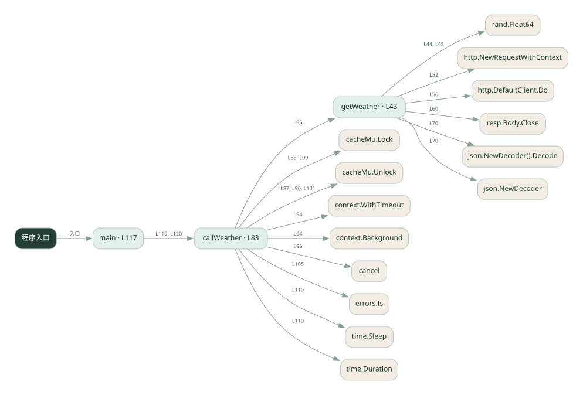
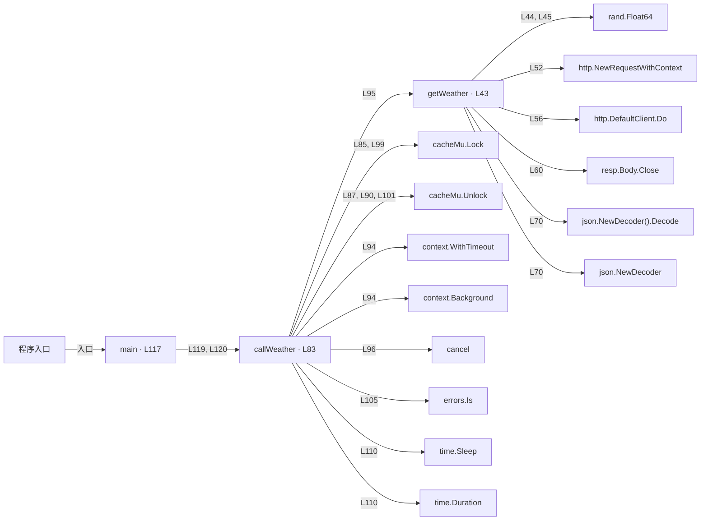

# robust_tools.go · 工具超时与重试

课程：1-8 · 全课程第 8 节。源码快照 SHA-256 前 12 位：`f01f4553555d`。

[原文件](../robust_tools.go) · [网页阅读](pages/robust_tools.go.html) · [放大调用图](graphs/robust_tools.go.svg)

## 这份文件要完成什么

给天气工具增加失败重试、超时处理和结果缓存。

## 为什么需要它

外部请求会失败或重复发生，不能让一次偶发错误终止整个流程。

## 当前文件的实际状态

- 用 context.WithTimeout 和带 context 的 HTTP 请求访问真实天气接口；缓存 map 由互斥锁保护。超时取消与 Python 线程等待超时机制不同。
- 存在外部服务或模型依赖；执行前需按源文件配置依赖和凭据，可能联网或产生 API 费用。 本次只做静态解析，没有运行练习，也没有替你填写或修改原代码。

## 调用图 / 阅读与数据流程

实线：源码中的直接调用；虚线：函数引用/注册、动态调用或按方法名推断的候选。L 是调用所在源码行号。箭头不表示执行顺序或每次必经；分支、循环、异步调度及框架内部调用需结合源码。灰色是外部/未解析目标，橙色是动态分发；省略 print、len 和常规容器操作以减少干扰。孤立函数可能尚未接入。

Mermaid 图源

## 从哪里开始看

先从 main（程序入口） 出发，沿箭头找到本文件函数，再查看外部调用或动态分发。右侧调用清单保留所有静态调用点，能回到原文件逐行对照。

## 关键函数与依赖

| 函数 / 定义行 | 职责（源码注释供参考） | 函数体中的调用 |
|---|---|---|
| `getWeather` [L43](../robust_tools.go#L43) | 真实天气接口（Open-Meteo 免费），超时靠 context | `rand.Float64, fmt.Errorf, http.NewRequestWithContext, http.DefaultClient.Do, resp.Body.Close, json.NewDecoder().Decode, json.NewDecoder, fmt.Sprintf` |
| `callWeather` [L83](../robust_tools.go#L83) | 以源码函数体为准；下列调用展示其依赖。 | `cacheMu.Lock, cacheMu.Unlock, context.WithTimeout, context.Background, getWeather, cancel, fmt.Sprintf, errors.Is, fmt.Printf, time.Sleep, time.Duration` |
| `main` [L117](../robust_tools.go#L117) | 以源码函数体为准；下列调用展示其依赖。 | `fmt.Println, callWeather` |

## 这样做的优点

临时故障可恢复，相同查询命中缓存时减少重复请求。

## 代价与局限

重试增加延迟；按城市缓存会过期。缓存查询结果不等于保证写操作幂等。

## 适合什么场景

只读查询、可以安全重复的工具。

## 不适合直接照搬的场景

扣款、发信等有副作用的操作，除非另有业务幂等机制。

## 改一个条件，检验是否理解

让第一次请求失败，检查重试次数；再查同城，检查缓存是否省去请求。

如果当前文件有未实现位置，先预测应该怎样变化，补齐后再验证；不要把“能启动”当作“实现正确”。

## 全部静态调用点

这是语法分析清单，包含图中省略的基础操作；不记录参数值。

| 调用方 | 目标表达式 | 行号 | 类型 |
|---|---|---|---|
| getWeather | `rand.Float64` | 44 | 调用表达式 |
| getWeather | `rand.Float64` | 45 | 调用表达式 |
| getWeather | `fmt.Errorf` | 46 | 调用表达式 |
| getWeather | `http.NewRequestWithContext` | 52 | 调用表达式 |
| getWeather | `http.DefaultClient.Do` | 56 | 调用表达式 |
| getWeather | `resp.Body.Close` | 60 | 调用表达式 |
| getWeather | `fmt.Errorf` | 62 | 调用表达式 |
| getWeather | `json.NewDecoder().Decode` | 70 | 调用表达式 |
| getWeather | `json.NewDecoder` | 70 | 调用表达式 |
| getWeather | `fmt.Sprintf` | 74 | 调用表达式 |
| callWeather | `cacheMu.Lock` | 85 | 调用表达式 |
| callWeather | `cacheMu.Unlock` | 87 | 调用表达式 |
| callWeather | `cacheMu.Unlock` | 90 | 调用表达式 |
| callWeather | `context.WithTimeout` | 94 | 调用表达式 |
| callWeather | `context.Background` | 94 | 调用表达式 |
| callWeather | `getWeather` | 95 | 调用表达式 |
| callWeather | `cancel` | 96 | 调用表达式 |
| callWeather | `cacheMu.Lock` | 99 | 调用表达式 |
| callWeather | `cacheMu.Unlock` | 101 | 调用表达式 |
| callWeather | `fmt.Sprintf` | 102 | 调用表达式 |
| callWeather | `errors.Is` | 105 | 调用表达式 |
| callWeather | `fmt.Printf` | 106 | 调用表达式 |
| callWeather | `fmt.Printf` | 108 | 调用表达式 |
| callWeather | `time.Sleep` | 110 | 调用表达式 |
| callWeather | `time.Duration` | 110 | 调用表达式 |
| callWeather | `fmt.Sprintf` | 114 | 调用表达式 |
| main | `fmt.Println` | 118 | 调用表达式 |
| main | `fmt.Println` | 119 | 调用表达式 |
| main | `callWeather` | 119 | 调用表达式 |
| main | `fmt.Println` | 120 | 调用表达式 |
| main | `callWeather` | 120 | 调用表达式 |
