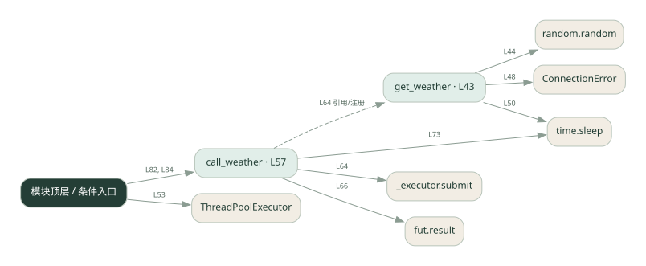
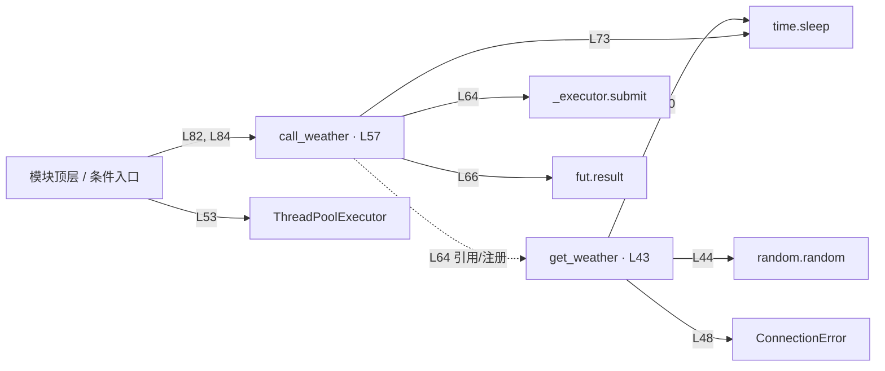

# robust_tools.py · 工具超时与重试

课程：1-8 · 全课程第 8 节。源码快照 SHA-256 前 12 位：`596906ee56a4`。

[原文件](../robust_tools.py) · [网页阅读](pages/robust_tools.py.html) · [放大调用图](graphs/robust_tools.py.svg)

## 这份文件要完成什么

给天气工具增加失败重试、超时处理和结果缓存。

## 为什么需要它

外部请求会失败或重复发生，不能让一次偶发错误终止整个流程。

## 当前文件的实际状态

- get_weather 用随机故障/等待模拟服务。Future.result(timeout=...) 只限制等待结果，不会杀掉线程；线程池上下文退出可能继续等待任务。
- 主要展示本地计算、内存状态或模拟流程；是否写文件/启动子进程请看调用表。 本次只做静态解析，没有运行练习，也没有替你填写或修改原代码。

## 调用图 / 阅读与数据流程

实线：源码中的直接调用；虚线：函数引用/注册、动态调用或按方法名推断的候选。L 是调用所在源码行号。箭头不表示执行顺序或每次必经；分支、循环、异步调度及框架内部调用需结合源码。灰色是外部/未解析目标，橙色是动态分发；省略 print、len 和常规容器操作以减少干扰。孤立函数可能尚未接入。

Mermaid 图源

## 从哪里开始看

先从 模块入口 出发，沿箭头找到本文件函数，再查看外部调用或动态分发。右侧调用清单保留所有静态调用点，能回到原文件逐行对照。

## 关键函数与依赖

| 函数 / 定义行 | 职责（源码注释供参考） | 函数体中的调用 |
|---|---|---|
| `get_weather` [L43](../robust_tools.py#L43) | 以源码函数体为准；下列调用展示其依赖。 | `random.random, ConnectionError, time.sleep` |
| `call_weather` [L57](../robust_tools.py#L57) | 以源码函数体为准；下列调用展示其依赖。 | `range, _executor.submit, fut.result, print, time.sleep` |

## 这样做的优点

临时故障可恢复，相同查询命中缓存时减少重复请求。

## 代价与局限

重试增加延迟；按城市缓存会过期。缓存查询结果不等于保证写操作幂等。

## 适合什么场景

只读查询、可以安全重复的工具。

## 不适合直接照搬的场景

扣款、发信等有副作用的操作，除非另有业务幂等机制。

## 改一个条件，检验是否理解

让第一次请求失败，检查重试次数；再查同城，检查缓存是否省去请求。

如果当前文件有未实现位置，先预测应该怎样变化，补齐后再验证；不要把“能启动”当作“实现正确”。

## 全部静态调用点

这是语法分析清单，包含图中省略的基础操作；不记录参数值。

| 调用方 | 目标表达式 | 行号 | 类型 |
|---|---|---|---|
| get_weather | `random.random` | 44 | 调用表达式 |
| get_weather | `ConnectionError` | 48 | 调用表达式 |
| get_weather | `time.sleep` | 50 | 调用表达式 |
| <模块入口> | `ThreadPoolExecutor` | 53 | 调用表达式 |
| call_weather | `range` | 63 | 调用表达式 |
| call_weather | `_executor.submit` | 64 | 调用表达式 |
| call_weather | `fut.result` | 66 | 调用表达式 |
| call_weather | `print` | 70 | 调用表达式 |
| call_weather | `print` | 72 | 调用表达式 |
| call_weather | `time.sleep` | 73 | 调用表达式 |
| <模块入口> | `print` | 80 | 调用表达式 |
| <模块入口> | `range` | 81 | 调用表达式 |
| <模块入口> | `print` | 82 | 调用表达式 |
| <模块入口> | `call_weather` | 82 | 调用表达式 |
| <模块入口> | `print` | 83 | 调用表达式 |
| <模块入口> | `print` | 84 | 调用表达式 |
| <模块入口> | `call_weather` | 84 | 调用表达式 |
| call_weather | `get_weather` | 64 | 函数引用/注册 |
