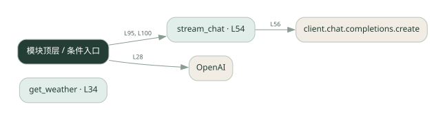
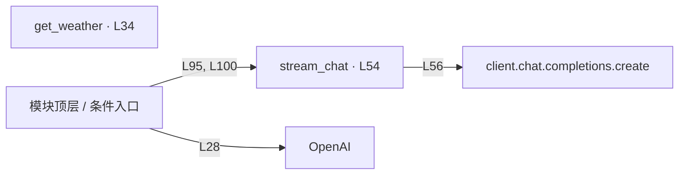

# stream_agent.py · 流式输出与工具调用

课程：1-5 · 全课程第 5 节。源码快照 SHA-256 前 12 位：`52aa9f73e4bb`。

[原文件](../stream_agent.py) · [网页阅读](pages/stream_agent.py.html) · [放大调用图](graphs/stream_agent.py.svg)

## 这份文件要完成什么

逐段接收模型输出；工具参数收齐后再调用工具，把结果交回模型。

## 为什么需要它

整段生成完才显示会让用户一直等待，而工具参数又可能被切成多段。

## 当前文件的实际状态

- 模型请求与本地工具是不同边界：这些文件中的天气工具使用示例逻辑，不能将示例天气当成实时查询结果。
- 存在外部服务或模型依赖；执行前需按源文件配置依赖和凭据，可能联网或产生 API 费用。 本次只做静态解析，没有运行练习，也没有替你填写或修改原代码。

## 调用图 / 阅读与数据流程

实线：源码中的直接调用；虚线：函数引用/注册、动态调用或按方法名推断的候选。L 是调用所在源码行号。箭头不表示执行顺序或每次必经；分支、循环、异步调度及框架内部调用需结合源码。灰色是外部/未解析目标，橙色是动态分发；省略 print、len 和常规容器操作以减少干扰。孤立函数可能尚未接入。

Mermaid 图源

## 从哪里开始看

先从 模块入口 出发，沿箭头找到本文件函数，再查看外部调用或动态分发。右侧调用清单保留所有静态调用点，能回到原文件逐行对照。

## 关键函数与依赖

| 函数 / 定义行 | 职责（源码注释供参考） | 函数体中的调用 |
|---|---|---|
| `get_weather` [L34](../stream_agent.py#L34) | 以源码函数体为准；下列调用展示其依赖。 | `未发现显式函数调用（可能直接计算、读写状态或尚未实现）` |
| `stream_chat` [L54](../stream_agent.py#L54) | 以源码函数体为准；下列调用展示其依赖。 | `client.chat.completions.create, print, len, tool_calls.append` |

## 这样做的优点

用户更早看到文字；能理解文字流和工具调用如何衔接。

## 代价与局限

分片组装、多个工具索引和中途断流增加处理难度；流式不保证总耗时更短。

## 适合什么场景

聊天界面、需要即时反馈的问答。

## 不适合直接照搬的场景

只需要最终结构化结果的后台批处理。

## 改一个条件，检验是否理解

观察一个工具参数是否分多次到达：参数完整前能否解析 JSON？

如果当前文件有未实现位置，先预测应该怎样变化，补齐后再验证；不要把“能启动”当作“实现正确”。

## 全部静态调用点

这是语法分析清单，包含图中省略的基础操作；不记录参数值。

| 调用方 | 目标表达式 | 行号 | 类型 |
|---|---|---|---|
| <模块入口> | `OpenAI` | 28 | 调用表达式 |
| stream_chat | `client.chat.completions.create` | 56 | 调用表达式 |
| stream_chat | `print` | 75 | 调用表达式 |
| stream_chat | `len` | 81 | 调用表达式 |
| stream_chat | `tool_calls.append` | 82 | 调用表达式 |
| <模块入口> | `print` | 94 | 调用表达式 |
| <模块入口> | `stream_chat` | 95 | 调用表达式 |
| <模块入口> | `print` | 96 | 调用表达式 |
| <模块入口> | `print` | 99 | 调用表达式 |
| <模块入口> | `stream_chat` | 100 | 调用表达式 |
| <模块入口> | `print` | 101 | 调用表达式 |
